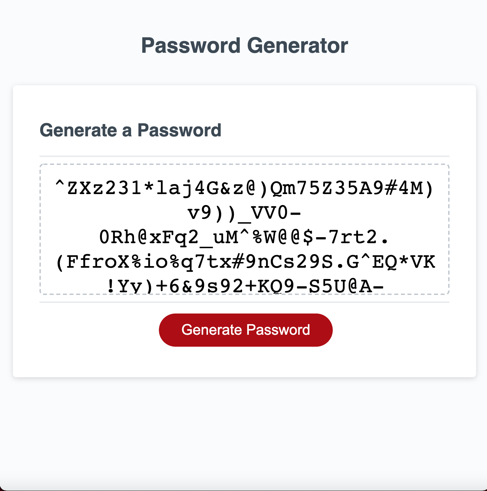

# Super-Duper-Password-Generator

UW Code Bootcamp Week 3 Homework

## Table of Contents

- [Developer Comment](#developer-comment)
- [Employer Request](#employer-request)
- [User Story](#user-story)
- [Acceptance Criteria](#acceptance-criteria)
- [Mockup](#mockup)
- [Website Features and Highlights](#website-features-and-highlights)
- [Live Project Site](#live-project-site)
- [Installation and Git Repository](#installation-and-git-repository)
- [Credits](#credits)

## Developer Comment

Hello everyone, and welcome back to my Repo! My name is Abdulhakeem Dahir and I am an aspiring Software Developer. This week I have been tasked to make Super Duper Password Generator. This is our FIRST ALL JAVASCRIPT assignment! It was pretty difficult, but getting it done was worthwhile. Any feedback is welcome! Thank you!

## Employer Request

An Employee is looking to automate their workflow, and they require a Password Generator. We are tasked to create a robust Password Generator solution that would enable the employee to choose what they want in their password and to make it entirely random. Below is their User Story:

### User Story

```
AS AN employee with access to sensitive data
I WANT to randomly generate a password that meets certain criteria
SO THAT I can create a strong password that provides greater security
```

### Acceptance Criteria

```
GIVEN I need a new, secure password
WHEN I click the button to generate a password
THEN I am presented with a series of prompts for password criteria
WHEN prompted for password criteria
THEN I select which criteria to include in the password
WHEN prompted for the length of the password
THEN I choose a length of at least 8 characters and no more than 128 characters
WHEN prompted for character types to include in the password
THEN I choose lowercase, uppercase, numeric, and/or special characters
WHEN I answer each prompt
THEN my input should be validated and at least one character type should be selected
WHEN all prompts are answered
THEN a password is generated that matches the selected criteria
WHEN the password is generated
THEN the password is either displayed in an alert or written to the page
```

## Mockup


## Website Features and Highlights

The follwing are all of the feautres and highlights of my portfolio:

### HTML & CSS

```
- We were given the HTML and CSS.
```

### JAVASCRIPT

```
- Created a fully robust Password Generator.
- The generator allows for 5 options:
- Password Length (Between 8-128), Uppercase, Lowercase, Numbers, and Special Characters.
- Passwords WILL NOT be made for any Password Length below 8 and above 128.
- User is prompted to choose any combination of the aforementioned choices.
- User will be given the generated password once all inputs have been made.
- Used Arrays, Functions, For Loops, If Loops and Callbacks.
```

## Live Project Site

https://abdulhakeemdahir.github.io/Super-Duper-Password-Generator/



## Installation and Git Repository

Respository: https://github.com/abdulhakeemdahir/Super-Duper-Password-Generator

Please follow the installation process below:

```
1. Fork the repository from the link above
2. Clone the repo to your computer via git
3. Open the project files with the text editor of your choice.
```
